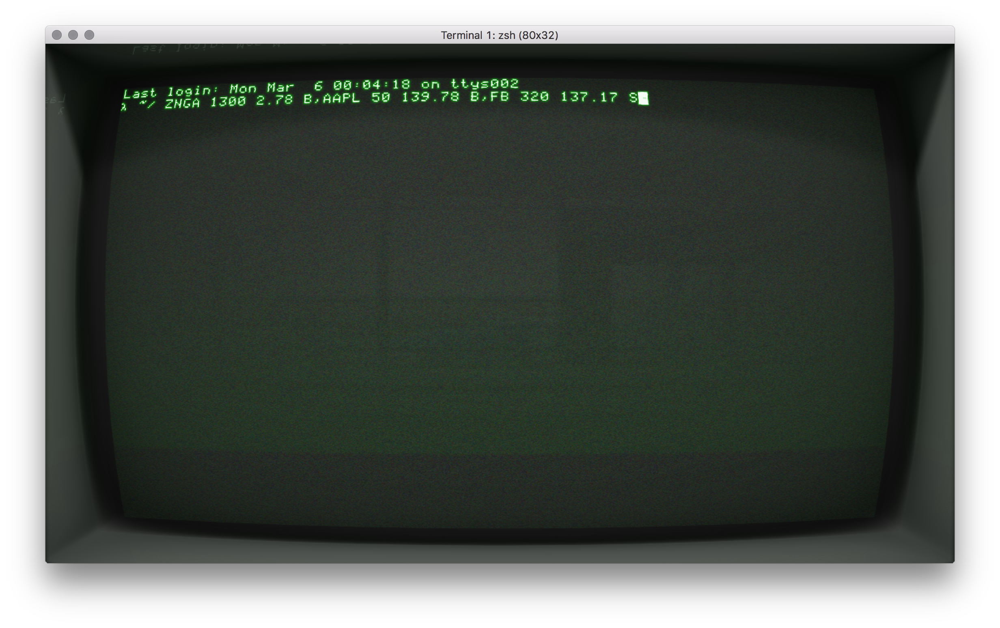

# Test Doubles in Java

This repository contains training materials used as part of the [Serenity Dojo](http://serenity.io) mentoring programme.
 
The goal of the exercises and demos you'll find here is to help you learn more 
about all the different [Test Doubles](http://xunitpatterns.com/Test%20Double.html) and become more
comfortable with using tools such as [Mockito](http://site.mockito.org/).

## The Little Mocker - know your doubles

The [`serenitylabs.tutorials.testdoubles.classic`](src/test/java/serenitylabs/tutorials/testdoubles/classic)
package contains five classes demonstrating when and how to use: 
- a [`Dummy`](src/test/java/serenitylabs/tutorials/testdoubles/classic/WhenUsingADummy.java),
- a [`Stub`](src/test/java/serenitylabs/tutorials/testdoubles/classic/WhenUsingAStub.java),
- a [`Spy`](src/test/java/serenitylabs/tutorials/testdoubles/classic/WhenUsingASpy.java),
- a [`Mock`](src/test/java/serenitylabs/tutorials/testdoubles/classic/WhenUsingAMock.java),
- and a [`Fake`](src/test/java/serenitylabs/tutorials/testdoubles/classic/WhenUsingAFake.java).

All the five test doubles have been implemented using plain-old Java to help you understand their inner workings better.

#### Useful resources:
- ["The Little Mocker"](https://8thlight.com/blog/uncle-bob/2014/05/14/TheLittleMocker.html) by Robert C. Martin
- ["xUnit Test Patterns - Test Double"](http://xunitpatterns.com/Test%20Double.html) by Gerard Meszaros

## Exercise 1: The Little Mocker - using Mockito

Now that you understand how the test doubles work, try to implement them yourself using Mockito 
using the ["classic"](src/test/java/serenitylabs/tutorials/testdoubles/classic)
implementation as a reference.

There are five empty test classes waiting for you at 
[`serenitylabs.tutorials.testdoubles.mockito`](src/test/java/serenitylabs/tutorials/testdoubles/mockito)
to give you a place to start.

#### Useful resources:
- [Mockito manual](https://static.javadoc.io/org.mockito/mockito-core/2.7.13/org/mockito/Mockito.html#1)

## Exercise 2: The Stock Broker

Now that you're warmed up it's time for something slightly more ambitious - the Stock Broker kata.

### The Big Picture

A client can interact with the Stock Broker using a text terminal.

 
 
To place a single order, the client would type:

```
GOOG 300 829.08 B
```

The order command is composed of the following four parts:
- [ticker symbol](https://en.wikipedia.org/wiki/Ticker_symbol), such as `GOOG`
- quantity, such as `300`
- price in USD, such as `829.08`
- type of order - Buy (`B`) or Sell (`S`)

The client could also place an order covering multiple stocks.

A multi-order is a coma-separated list of regular orders:
```
ZNGA 1300 2.78 B,AAPL 50 139.78 B,FB 320 137.17 S
```

**HINT** For the purpose of this exercise it's fine to assume that the input data provided by the user is always well-formed
and correct.

### The Domain

The domain is modelled using three main classes:
- `Client` - The client receives a string representation of the order, parses it and asks the `StockBroker` to
execute the order.
- `StockBroker` - The stock broker interacts with the stock exchange. He's responsible for producing an `OrderSummary`
to tell the client how much was spent on buying and selling the stocks.
- `StockExchange` - You should assume that the stock exchange connects to the _real_ stock exchange and any order placed
here will be executed.

### The Goal

The goal of this kata is to implement the `Client` and the `StockBroker` (and potentially some other classes that you think
you'll need) so that when the `Client` receives a command such as this one:

```
GOOG 300 829.08 B
```

it responds with an order summary presenting the total amount of money spent and earned 
(assuming the order was executed correctly by the exchange):

```
Buy: USD 248724.00, Sell: USD 0.00
```

### Examples

An empty order is not treated as an error and should produce the following summary:

```
input:  
output: Buy: USD 0.00, Sell: USD 0.00
```

For a single, correctly executed order we'd have:

```
input:  GOOG 300 829.08 B  
output: USD 248724.00, Sell: USD 0.00
```

And for a multi-order:

```
input:  ZNGA 1300 2.78 B,AAPL 50 139.78 B,FB 320 137.17 S
output: Buy: USD 10603.00, Sell: USD 43894.40
```

If any of the orders could not be executed by the exchange, the summary should mention this as well.
For example, assuming the exchange could not execute the `GOOG` order:

```
input:  GOOG 300 829.08 B  
output: USD 0.00, Sell: USD 0.00, Failed: GOOG
```
 
And if several stocks failed (for example `FB` and `ORCL`), but other worked fine:

```
input:  ZNGA 1300 2.78 B,AAPL 50 139.78 B,FB 320 137.17 S,ORCL 1000 42.69 S
output: Buy: USD 10603.00, Sell: USD 00.40, Failed: FB, ORCL
```

### Hints

#### Design from the outside

Design your solution starting from the outside - start with the [`ClientTest`](src/test/java/serenitylabs/tutorials/stockbroker/ClientTest.java) 
and work your way down, providing real implementations or mocks of the dependencies when needed.

##### Useful resources:
- [How to write good tests](https://github.com/mockito/mockito/wiki/How-to-write-good-tests)
- [Constructor dependency injection](https://en.wikipedia.org/wiki/Dependency_injection)

#### A note on regular expressions

The `Client` class uses an implementation of the `OrderParser` interface to convert the input received 
from the user into a list of `Order` objects.

If you like playing with regular expressions or want to increase the level of difficulty of this exercise 
you might want to implement the parser from scratch. 

If you'd rather focus on mocking it's perfectly fine to use the 
[`OptimisticOrderParser`](src/main/java/serenitylabs/tutorials/stockbroker/parser/OptimisticOrderParser.java),
which you'll find in the [`stockbroker.parser`](src/main/java/serenitylabs/tutorials/stockbroker/parser) package.

##### Useful resources:
- [Regex tester](https://regex101.com/)

#### The Money class

This exercise uses the [Joda-Money](http://www.joda.org/joda-money/) implementation of the Money class.
To initialise the [`OptimisticOrderParser`](src/main/java/serenitylabs/tutorials/stockbroker/parser/OptimisticOrderParser.java)
with the correct currency unit use `CurrencyUnit.USD`.

---

Have fun!

[Jan](https://janmolak.com) and the [Serenity Team](http://serenity.io)